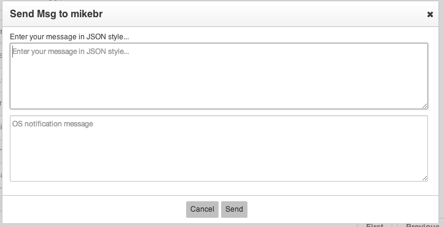

Back Office and Front Office {#backoffice}
========

## Links

1. \htmlonly <a href=https://account.clanofthecloud.com/ target="_blank">Front Office</a> \endhtmlonly
2. \htmlonly <a href=https://sandbox-backoffice.clanofthecloud.com/ target="_blank">Backoffice for SANDBOX</a> \endhtmlonly

- - - -

# The Back office

The Back Office website gives you access to several informations about your game :

* Counters
	- Users *Numbers of user registered in your game*

	the 'Go' button display the users, it's recommanded to use a filter if there is many users.
	
	- CCU *Numbers of concurrent users*
	- Requets *Number of access to the server*
	- Events *Number of messages exchange by users*
	- Noticiation *Number of OS Notification sent*

* Game Stats
	- the last 30 DAU *Daily Active Users*
	- the last 12 MAU *Monthly Active Users*

* Leaderboards
	
	Display the list of the leaderboard of the game.
	You can reset leaderboard for all users, or only one user.
	You can display the bests 50 highscores of a leaderboard.

* Users (the 'Go' button)
	The screen shows the users, and allows to
	- Delete a user
	- Send an 'OS' notification to a selected user (Megaphone icon)
	- Send an 'OS' notification to all users (`NOTIFY ALL' button)   
	
	**this notification will be sent to really all users, not only the displayed one !**

* Notification format

	* In the 'Message' text area, enter the "technical" message in JSON format which will be handle by your game (i.e. announce new level available)
	* In the 'OS message' test area, enter the message that the OS will display if the game is in background when the notisification is sent. The format is a localized json. 	
~~~~
	{"fr": "Bonjour", "en" : "Hello"}
~~~~
   
The localisation user will match the 'lang' parameter in the profile of the user, or 'en' be default.
See [SendEvent](@ref CotcSdk.GamerCommunity.SendEvent) for more information

# The Front office

The front office allows you to configure your games.
